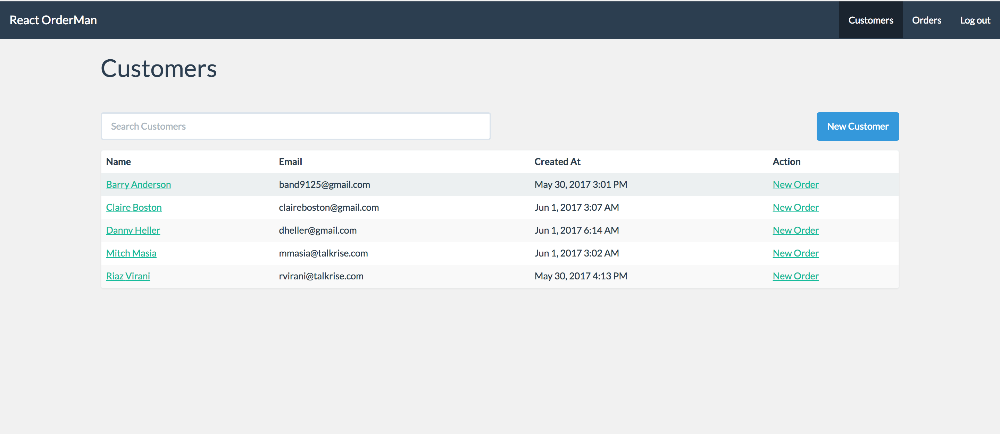
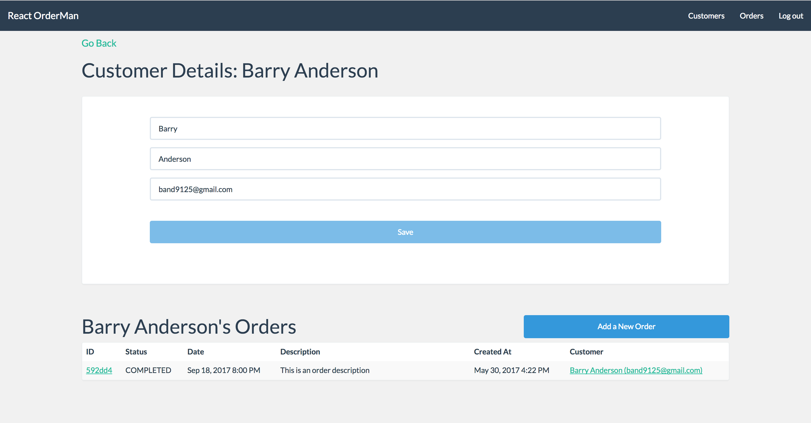
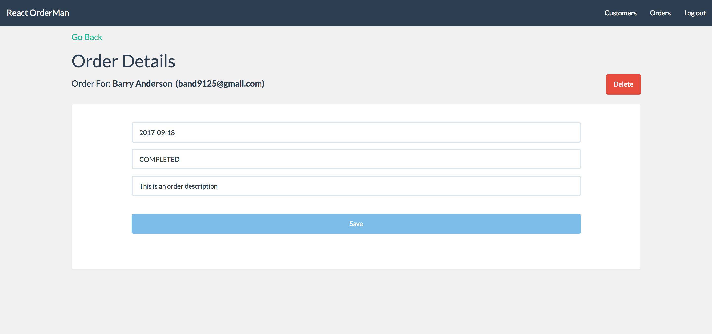

  

# TalkRise OrderMan Project
This is a reference project used in the TalkRise React course. It allows users to perform CRUD management on *Customers* and *Orders* like an System Administrator would on an order management platform.

If you're interested in learning more about TalkRise courses, [check them out](https://www.talkrise.com).

## Overview

* [Goals](#goals)
* [Screenshot](#screenshot)
* [Requirements](#requirements)
* [Setup](#setup)
* [Instructions](#instructions)
* [Milestones](#milestones)
  * [Milestone 1](#milestone-1---react-components)
  * [Milestone 2](#milestone-2---react-routing)
  * [Milestone 3](#milestone-3---redux-and-forms)
* [License](#license)

## Goals

The goals of this project are to further students' advanced React-Redux topics including:

* Feature-Focused Application Structure
* Routing and Authentication
* Async Actions with Redux Thunk
* Testing Components and Logic

### Screenshots

#### Customers Index Page

 

   <kbd> 
     
   </kbd>
 

 
### Customers Show Page

  

     <kbd> 
       
     </kbd>
   

### Orders Show Page

   <kbd> 
     
   </kbd>
 

## Requirements

This project aims to stay compatible with the latest
[Node LTS Release](https://github.com/nodejs/LTS), which at the time of last testing was Node 6.

Specifically, this project uses:

* Node v6.10.3
* npm v.3.10.10

You will also need [Yarn](https://yarnpkg.com/en/).

## Setup

**There are two ways to start learning on this project:**

1. *Fork it* (Recommended)
2. *Clone it* (This will prohibit you from deploying your changes to a production environment)

**We recommend forking this project in order to push your changes to your own production environment.**

**This project is accompanied by a Node-Express backend that serves as the API for this React front-end. You will need to run this API to retrieve stock information.**

The API and instructions to configure it are available [here](https://github.com/TalkRise/React_OrderMan_API).

## Instructions

The `master` branch is your starting point on this project. After you create your fork, this is where you should begin writing code.

There are also 3 other branches, `m1_complete`, `m2_complete`, and `m3_complete`. Each of these branches is our reference solution to the requirements in milestones 1, 2, and 3, respectively.

While you are doing your work in `master`, feel free to look at our solutions for guidance on each milestone.

*Note:* Our reference solution is just 1 possible way to build your app. If you feel the desire to write something differently, do it!

In the [Milestones](#milestones) section below, you will see links to the explicit instructions for each milestone. You will also find links to our solutions deployed on Heroku.

## Milestones
The project is broken down into 3 milestones.

### Milestone 1 - Redux Setup, Routing, and Forms

* [Milestone 1 Instructions](https://github.com/TalkRise/React_OrderMan_Client/blob/master/docs/m1_instructions.md)
* [Milestone 1 Solution](https://github.com/TalkRise/React_OrderMan_Client/tree/m1_complete)
* [Milestone 1 Demo](https://react-orderman-m1.herokuapp.com/#/)

### Milestone 2 - Authentication and Customers

* [Milestone 2 Instructions](https://github.com/TalkRise/React_OrderMan_Client/blob/master/docs/m2_instructions.md)
* [Milestone 2 Solution](https://github.com/TalkRise/React_OrderMan_Client/tree/m2_complete)
* [Milestone 2 Demo](https://react-orderman-m2.herokuapp.com/#/)

### Milestone 3 - Orders

* [Milestone 3 Instructions](https://github.com/TalkRise/React_OrderMan_Client/blob/master/docs/m3_instructions.md)
* [Milestone 3 Solution](https://github.com/TalkRise/React_OrderMan_Client/tree/m3_complete)
* [Milestone 3 Demo](https://react-orderman-m3.herokuapp.com/#/)

## License
This project is released under the [MIT license](MIT-LICENSE). Go nuts!

 
Built By:

 

   
 

