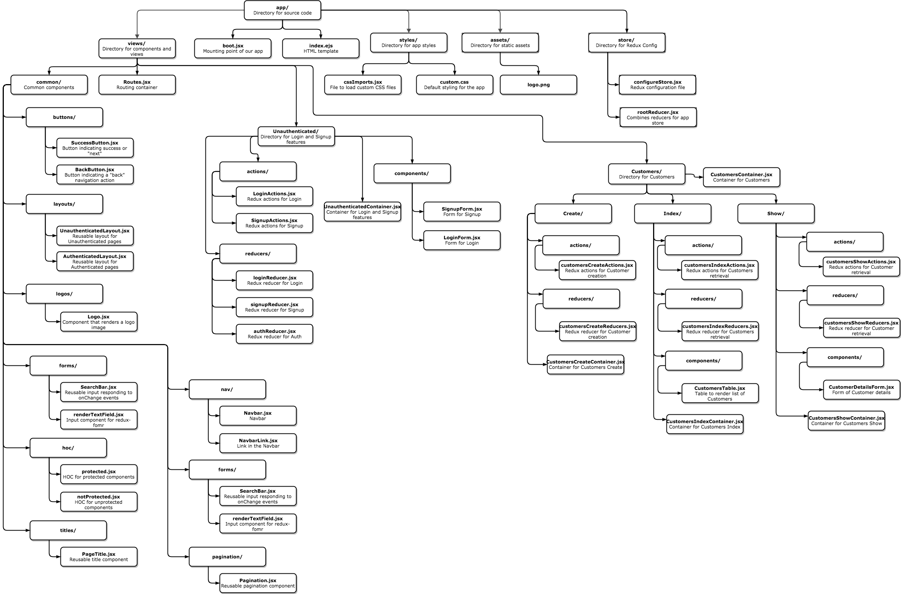

<p align="center">
  
</p>

# TalkRise OrderMan Milestone 2
These are the docs for Milestone 2 of this project. They are meant to tell you *what* to do, but not *how* to do it in great detail. If you need additional help, see the reference solution by checking out branch [`m2_complete`](https://github.com/TalkRise/React_OrderMan_Client/tree/m2_complete), or feel free to ask your instructor or other students.

When you are done with this milestone, you should have

* Configured Redux
* Integrated Redux with `react-router-dom` via `react-router-redux`
* Integrated Redux with your Login and Signup form via `redux-form`
 * Working Signup
 * Working Login
 * Setup a common layout for authenticated pages
 * CRUD Actions on Customers Models

## When to Use This Guide

You should use this guide when you are completing Milestone 2.

## Overview

* [Reference Solution](#reference-solution)
* [Setup](#setup)
* [Guide](#guide)

## Reference Solution

**If you need further help completing Milestone 2, please reference our solution in the [`m2_complete`](https://github.com/TalkRise/React_OrderMan_Client/tree/m2_complete) branch of this repo.**

[Milestone 2 Demo](https://react-orderman-m2.herokuapp.com/#/)
  
## Setup

1. Make sure the [API](https://github.com/TalkRise/React_OrderMan_API) is running.

2. For the API docs, check [here](https://react-orderman-api.herokuapp.com/docs).

3. Make sure you are using the right version of Node and npm (we use nvm for node version management)

```bash
nvm use
```

4. Install dependencies and start the development server for this repo

```bash
yarn
npm run dev
```

## Application Structure

We use a feature-focused organization for our app where our directories represent the different pages of the application.

 <p align="center">
   
 </p>
 
 We know this looks super intimidating, but stay calm, follow our instructions, and we'll get through this milestone together!
 
 ## Instructions to Complete M2
 
These are the instructions to complete Milestone 2. 

**Install New Dependencies**

```bash
yarn add redux react-redux react-router-redux@next redux-form redux-thunk 
```

**Create New Files**

Use the *Application Structure* above to create several new files. Again, don't freak out, we'll guide through. 

* `store/rootReducer.jsx` - *File to create and combine Redux reducers. Start with the `routerReducer` from `react-router-redux` and the `formReducer` from `redux-form`.*

* `store/configureStore.jsx` - *Create and export a Redux store with `redux-thunk` middleware, `react-router-redux` middleware, and the Redux DevTools.*

**Update Files**

* Update `Routes.jsx` to use a `ConnectedRouter` from `react-router-redux` and wrap the entire component in a `Provider` using the Redux store you created.

**Keep Creating New Files**

* `utilities/apiUtilities.jsx` - **COPY AND PASTE this file from this [Gist](https://gist.github.com/masiamj/fb1f00a76a5b8ff81481811d6c2658ae).**

* `utilities/authUtilities.jsx` - **COPY AND PASTE this file from this [Gist](https://gist.github.com/masiamj/65d302df8ea76f49ee3cccd6c47b8027).**

* `hoc/protected.jsx` - *HOC to use in routing to make sure access to pages is authenticated. Use this HOC for pages like Customers and Orders. This component checks on componentWillMount and componentWillReceiveProps to make sure a user is authenticated.*

* `hoc/notProtected.jsx` - *HOC to use in routing to make sure access to pages is not authenticated. Use this HOC for pages like Login and Signup. This component checks on componentWillMount and componentWillReceiveProps to make sure a user is not authenticated.*

* `common/nav/NavbarLink.jsx` - *Component that renders a list-item indicating a link in the `Navbar`. Use Bootstrap's normal navbar model.*

* `common/nav/Navbar.jsx` - *Component that renders a Bootstrap nav. Will Contain `NavbarLink`s for Customers and Orders.*

* `common/pagination/Pagination.jsx` - *Renders Bootstrap's pagination component. Supports moving to a specific page by choosing page number and incrementing/decrementing pages.*

* `common/titles/PageTitle.jsx` - *Renders a simple page title that can be used on any page.*

* `common/layouts/AuthenticatedLayout` - *Reusable layout component for authenticated pages like Customer and Orders. Renders `Navbar`, `PageTitle`, and `children` in a reusable way.*

* `Unauthenticated/actions/loginActions.jsx` - *Redux-Thunk actions that POST to /users/authenticate.*

* `Unauthenticated/actions/signupActions.jsx` - *Redux-Thunk actions that POST to /users/register.*

* `Unauthenticated/reducers/loginReducer.jsx` - *Redux reducer that tracks state of login request.*

* `Unauthenticated/reducers/signupReducer.jsx` - *Redux reducer that tracks state of signup request.*

* `Unauthenticated/reducers/authReducer.jsx` - *Redux reducer that tracks authentication state. On initialization, it should check localStorage for the stored JWT, and set that in the initialState of the reducer.*

* `Customers/Index/actions/customersIndexActions.jsx` - *Redux-Thunk Actions that GET to /customers.*

* `Customers/Index/reducers/customersIndexReducers.jsx` - *Redux reducers that track the state of the customers index requests.*

* `Customers/Index/components/CustomersTable.jsx` - *Table rendering rows of Customer data. Also renders a `Pagination` component that responds to page change events.*

* `Customers/Index/CustomersIndexContainer.jsx` - *Connected Component that represents a list of Customers. Renders an `AuthenticatedLayout`, `SearchBar`, `SuccessButton`, and `CustomersTable`.*

* `Customers/Show/actions/customersShowActions.jsx` - *Redux-Thunk Actions that GET and PATCH to /customers/:id.*

* `Customers/Show/reducers/customersShowReducers.jsx` - *Redux reducers that track the state of the customers show requests.*

* `Customers/Show/components/CustomerDetailsForm.jsx` - *Form for rending/updating customer data. Should be able to render with or without initialValues.*

* `Customers/Show/CustomersShowContainer.jsx` - *Connected Component that represents a single Customer. Renders an `AuthenticatedLayout`, `CustomerDetailsForm` with initialValues.*

* `Customers/Create/actions/customersCreateActions.jsx` - *Redux-Thunk Actions that POST to /customers.*

* `Customers/Create/reducers/customersCreateReducers.jsx` - *Redux reducers that track the state of the customers create requests.*

* `Customers/Create/CustomersCreateContainer.jsx` - *Connected Component that represents creating a single customer. Renders an `AuthenticatedLayout`, `CustomerDetailsForm` without initialValues.*

* `Customers/CustomersContainer.jsx` - *A container that manages routing of Customers paths.. It renders a `Switch` from `react-router-dom` as well as three `Route`s, one pointing to `/customers` (renders `CustomersIndexContainer`), one pointing to `/customers/create` (renders `CustomersCreateContainer`), and one pointing to `/customers/:id` (renders `CustomersShowContainer`).

**Update Files**

* Update `Routes.jsx` to display the `/customers` route with the `protected` HOC and the `/` route with the `notProtected` HOC.

## Composite Redux State

```bash
{
  auth: {
    access_token: <string>,
  },
  customersCreate: {
    isFetching: <bool>,
    error: <Object || null>,
  },
  customersIndex: {
    isFetching: <bool>,
    customers: <array<Object>>,
    error: <Object || null>,
  },
  customersShow: {
    isFetching: <bool>,
    customer: <Object>,
    error: <Object || null>,
  },
  form: <redux-form>,
  login: {
    isFetching: <bool>,
    error: <Object || null>,
  },
  routing: <react-router-redux>,
  signup: {
    isFetching: <bool>,
    error: <Object || null>,
  },
}
```

For `<redux-form>` and `<react-router-redux>`, you should use the reducers built into those packages. Everything else will be custom-written by you.

## License

This project is released under the [MIT license](MIT-LICENSE). Go nuts!

 <p align="center">Built By:</p>
 <p align="center">
   
 </p>
