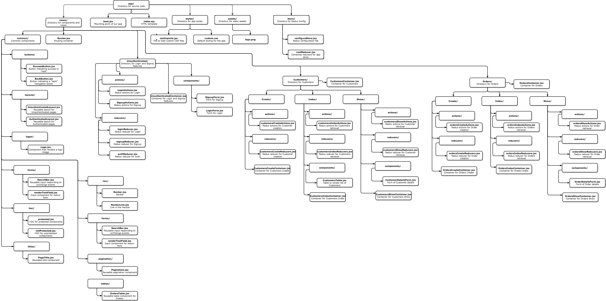

<p align="center">
  
</p>

# TalkRise OrderMan Milestone 3
These are the docs for Milestone 3 of this project. They are meant to tell you *what* to do, but not *how* to do it in great detail. If you need additional help, see the reference solution by checking out branch [`m3_complete`](https://github.com/TalkRise/React_OrderMan_Client/tree/m3_complete), or feel free to ask your instructor or other students.

When you are done with this milestone, you should have

* CRUD Actions on Orders Models
* Passing Jest Tests for Components, Actions, and Reducers

## When to Use This Guide

You should use this guide when you are completing Milestone 3.

## Overview

* [Reference Solution](#reference-solution)
* [Setup](#setup)
* [Guide](#guide)

## Reference Solution

**If you need further help completing Milestone 3, please reference our solution in the [`m3_complete`](https://github.com/TalkRise/React_OrderMan_Client/tree/m3_complete) branch of this repo.**

[Milestone 3 Demo](https://react-orderman-m3.herokuapp.com/#/)
  
## Setup

1. Make sure the [API](https://github.com/TalkRise/React_OrderMan_API) is running.

2. For the API docs, check [here](https://react-orderman-api.herokuapp.com/docs).

3. Make sure you are using the right version of Node and npm (we use nvm for node version management)

```bash
nvm use
```

4. Install dependencies and start the development server for this repo

```bash
yarn
npm run dev
```

## Application Structure

We use a feature-focused organization for our app where our directories represent the different pages of the application.

Test files are purposefully not included in the diagram below.

 <p align="center">
   
 </p>
 
Aside from tests, we only added a few components here! We're essentially replicating the *Customers* components for the *Orders* model this time.
 
 ## Instructions to Complete M3
 
These are the instructions to complete Milestone 3. 

**Install New Dependencies**

```bash
yarn add --dev jest react-test-renderer enzyme axios-mock-adapter redux-mock-store babel-jest jest-static-stubs
```

**Create New Files**

Use the *Application Structure* above to create several new files. Again, don't freak out, we'll guide through.

* `common/tables/OrdersTable.jsx` - *Table view for displaying Orders. Also includes pagination and can handle page changes.*
 
* `Orders/Index/actions/ordersIndexActions.jsx` - *Redux-Thunk Actions that GET to /orders.*
  
* `Orders/Index/reducers/ordersIndexReducers.jsx` - *Redux reducers that track the state of the orders index requests.*
  
* `Orders/Index/OrdersIndexContainer.jsx` - *Connected Component that represents creating a single customer. Renders an `AuthenticatedLayout`, `OrdersTable`.* 

* `Orders/Show/actions/ordersShowActions.jsx` - *Redux-Thunk Actions that GET and PATCH to /orders/:id.*
  
* `Orders/Show/reducers/ordersShowReducers.jsx` - *Redux reducers that track the state of the orders show requests.*

* `Orders/Show/components/OrderDetailsForm.jsx` - *Form for Order details using `redux-form`.*
  
* `Orders/Show/OrdersShowContainer.jsx` - *Connected Component that represents creating a single customer. Renders an `AuthenticatedLayout`, `OrderDetailsForm` with initialValues.* 

* `Orders/Create/actions/ordersCreateActions.jsx` - *Redux-Thunk Actions that POST to /orders.*
  
* `Orders/Create/reducers/ordersCreateReducers.jsx` - *Redux reducers that track the state of the orders create requests.*
  
* `Orders/Create/OrdersCreateContainer.jsx` - *Connected Component that represents creating a single customer. Renders an `AuthenticatedLayout`, `OrderDetailsForm` without initialValues.*
  
* `Orders/OrdersContainer.jsx` - *A container that manages routing of Orders paths. It renders a `Switch` from `react-router-dom` as well as three `Route`s, one pointing to `/orders` (renders `OrdersIndexContainer`), one pointing to `/orders/create/:customer_id` (renders `OrdersCreateContainer`, to know what customer the order is being created for), and one pointing to `/orders/:id` (renders `OrdersShowContainer`).

**Update Files and Testing**

* Update `package.json` for `jest` test configuration. See ours in the `m3_complete` branch!

  * You'll be keeping writing the following tests:
  
    * Snapshot tests for all "dumb" or not-connected components via `react-test-renderer`.
    * Shallow rendering tests for all "smart" or connected components via `enzyme`.
    * Synchronous tests for all Redux reducers.
    * Asynchronous tests for all Redux actions using `axios-mock-adapter` and `redux-mock-store`.

## Composite Redux State

```bash
{
  auth: {
    access_token: <string>,
  },
  customersCreate: {
    isFetching: <bool>,
    error: <Object || null>,
  },
  customersIndex: {
    isFetching: <bool>,
    customers: <array<Object>>,
    error: <Object || null>,
  },
  customersShow: {
    isFetching: <bool>,
    customer: <Object>,
    error: <Object || null>,
  },
  form: <redux-form>,
  login: {
    isFetching: <bool>,
    error: <Object || null>,
  },
  ordersCreate: {
    isFetching: <bool>,
    error: <Object || null>,
  },
  ordersIndex: {
    isFetching: <bool>,
    orders: <array<Object>>,
    error: <Object || null>
  },
  ordersShow: {
    isFetching: <bool>,
    order: <Object>,
    error: <Object || null>,
  },
  routing: <react-router-redux>,
  signup: {
    isFetching: <bool>,
    error: <Object || null>,
  },
}
```

For `<redux-form>` and `<react-router-redux>`, you should use the reducers built into those packages. Everything else will be custom-written by you.

## License

This project is released under the [MIT license](MIT-LICENSE). Go nuts!

 <p align="center">Built By:</p>
 <p align="center">
   
 </p>
